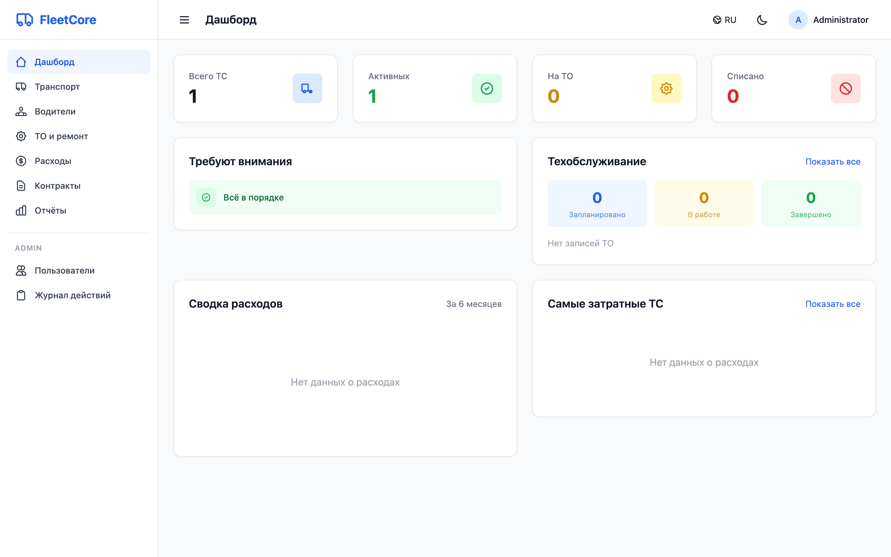
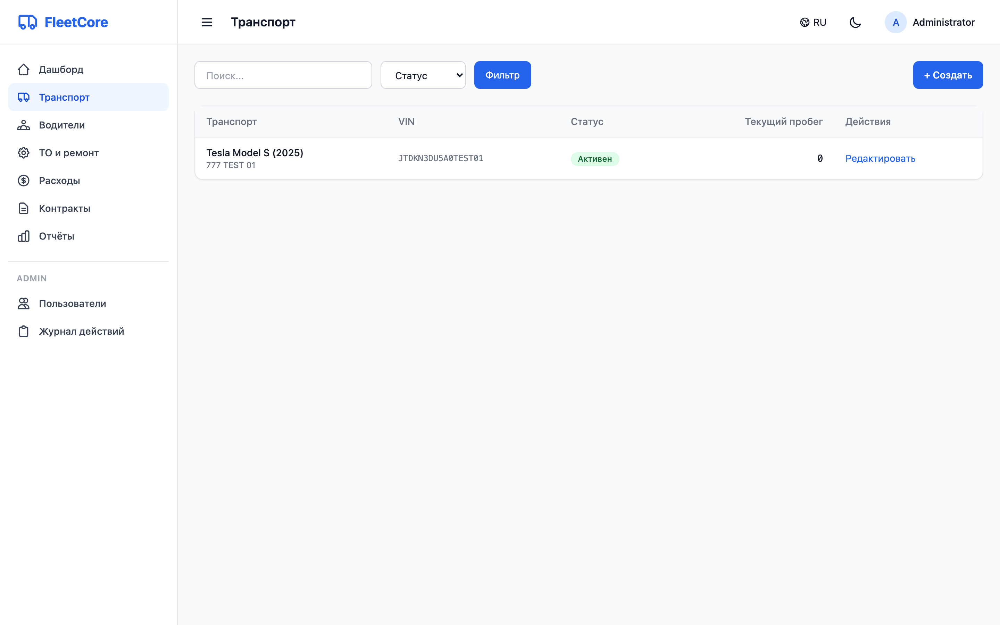
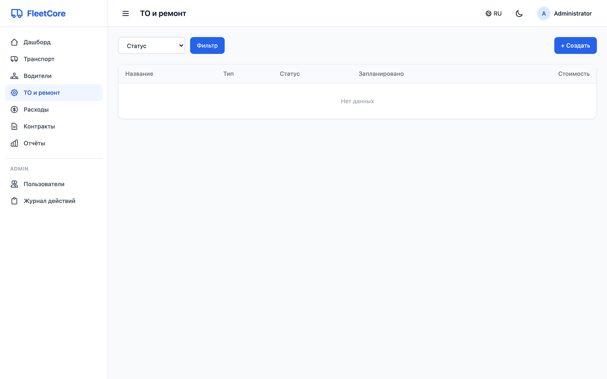
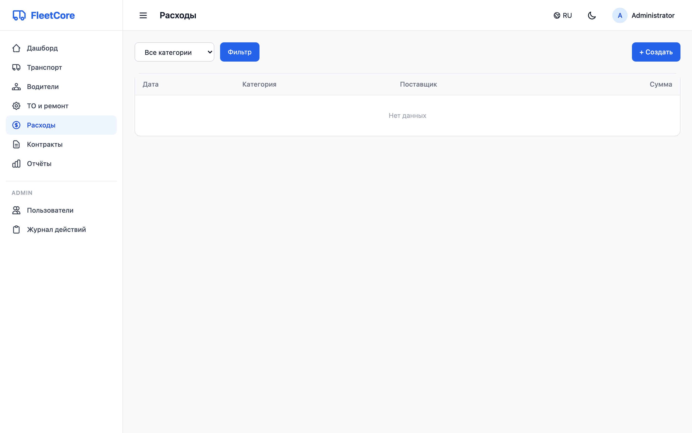
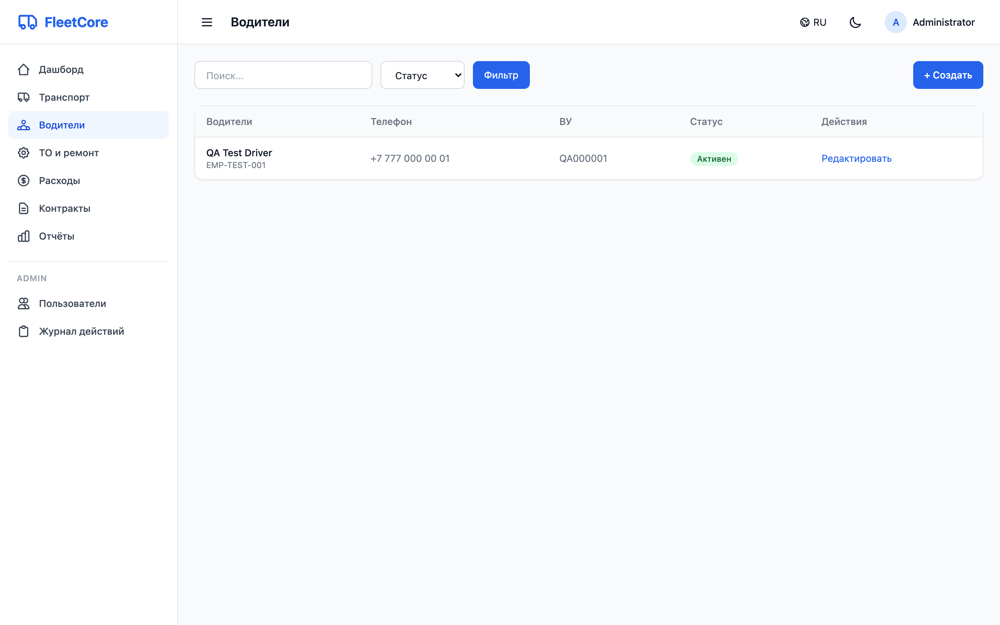
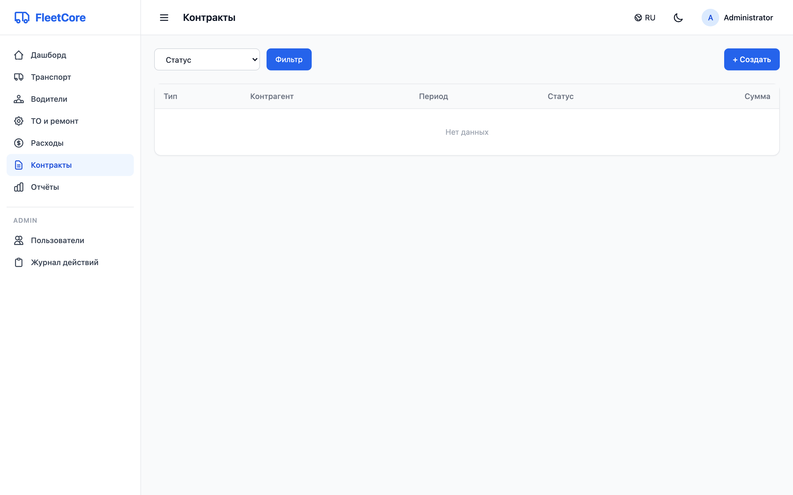
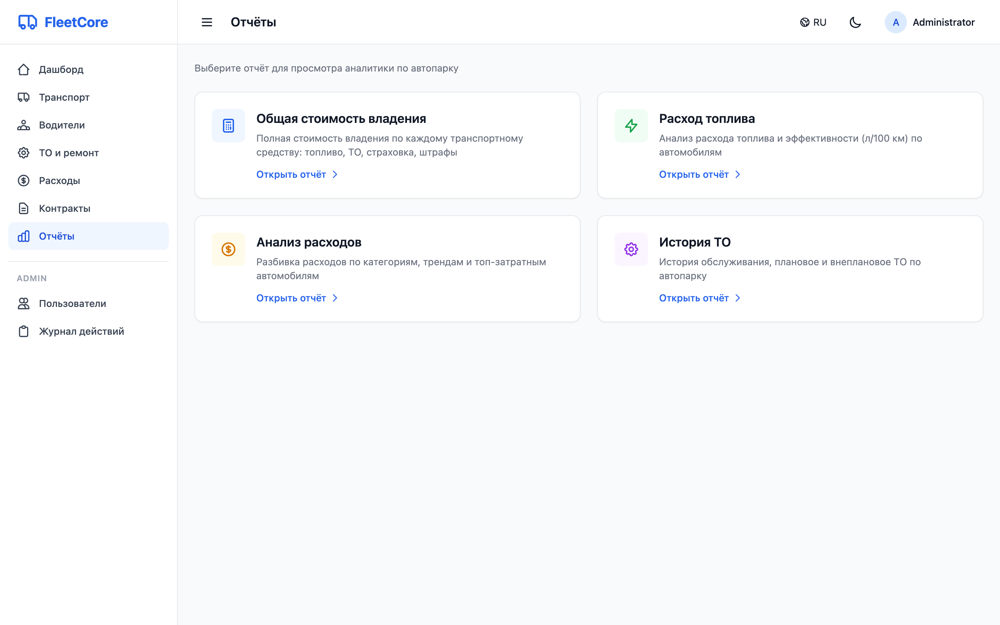

# FleetCore — Corporate Fleet Management System

Enterprise-grade fleet management system for 500+ vehicles. Self-hosted web application built with Python.



## Tech Stack

- **Backend**: FastAPI (async) + SQLAlchemy 2.0 + Alembic
- **Frontend**: Jinja2 + HTMX + Alpine.js + TailwindCSS
- **Database**: PostgreSQL 16
- **Cache/Queue**: Redis 7 + Celery
- **File Storage**: MinIO (S3-compatible)
- **Secrets**: HashiCorp Vault (dev mode)
- **Auth**: JWT + session cookies

## Quick Start

### Prerequisites

- Docker & Docker Compose
- Python 3.12 (conda recommended)

### 1. Start all services

```bash
docker compose up -d
```

This launches PostgreSQL, Redis, MinIO, Vault (dev mode), the app, Celery worker, and Celery beat. Vault automatically generates a random `SECRET_KEY` and seeds all required secrets.

### 2. Run migrations

```bash
docker compose exec app alembic upgrade head
```

### 3. Create superuser

```bash
docker compose exec -it app python scripts/create_superuser.py
```

You will be prompted for username, email, full name, and password (minimum 8 characters).

### 4. Seed demo data (optional)

```bash
docker compose exec app python scripts/seed_data.py
```

Generates 500+ vehicles, 200+ drivers, maintenance records, expenses, and contracts with realistic Kazakh data.

### 5. Open the application

Open http://localhost:8000 in your browser.

## Screenshots

| Dashboard | Vehicles |
|:---------:|:--------:|
|  |  |

| Maintenance | Expenses |
|:-----------:|:--------:|
|  |  |

| Drivers | Contracts |
|:-------:|:---------:|
|  |  |

| Reports | Settings |
|:-------:|:--------:|
|  |  |

## Features

### Modules

| Module | Description |
|--------|------------|
| **Vehicles** | Registry of 500+ vehicles with full specs, photos, QR codes |
| **Drivers** | Driver management with license/medical tracking |
| **Mileage** | Mileage logging with anomaly detection |
| **Maintenance** | Scheduled/unscheduled maintenance with Kanban view |
| **Expenses** | Cost tracking by category, fuel consumption analysis |
| **Contracts** | Leasing, insurance, service contracts with expiry alerts |
| **Documents** | File upload/download via MinIO (S3) |
| **Reports** | TCO, fleet utilization, fuel analysis with Excel/CSV export |
| **Notifications** | In-app, email (SMTP), Telegram alerts |
| **Audit Log** | Complete audit trail of all actions |

### Dashboard

- Fleet overview with vehicle status distribution
- Attention alerts (overdue maintenance, expiring contracts/licenses)
- Expense chart with category breakdown
- Top expensive vehicles
- Maintenance statistics

### Roles

| Role | Access |
|------|--------|
| `admin` | Full system access |
| `fleet_manager` | Vehicle, driver, maintenance, expense, contract management |
| `driver` | View assigned vehicles, submit mileage |
| `viewer` | Read-only dashboards and reports |

### Internationalization

Supported languages: Russian, English, Kazakh, Turkish.

Language can be switched from the top navigation bar and is stored per user.

## API

REST API available at `/api/v1/`:

- `POST /api/v1/auth/login` — authenticate
- `GET /api/v1/vehicles` — list vehicles
- `GET /api/v1/reports/fleet-utilization` — fleet stats
- `GET /api/v1/reports/export/tco.xlsx` — download Excel report
- Full Swagger docs at `/docs`

## Development

### Local development (without Docker for app)

```bash
# Create conda environment
conda create -n fleet-core python=3.12 -c conda-forge
conda activate fleet-core
pip install -e ".[dev]"

# Start infrastructure only
docker compose up -d db redis minio vault vault-init

# Run migrations
alembic upgrade head

# Start the app with hot-reload
uvicorn app.main:app --reload --host 0.0.0.0 --port 8000
```

### Run tests

```bash
pytest tests/ -v
```

### Run linter

```bash
ruff check app/
```

### Generate migration

```bash
alembic revision --autogenerate -m "description"
alembic upgrade head
```

### Celery worker (for background tasks)

```bash
celery -A app.tasks.celery_app worker -l info
celery -A app.tasks.celery_app beat -l info
```

## Architecture

```
app/
├── api/v1/          # REST API endpoints
├── web/             # Web UI routes (Jinja2 + HTMX)
├── models/          # SQLAlchemy ORM models
├── schemas/         # Pydantic request/response schemas
├── services/        # Business logic layer
├── repositories/    # Data access layer
├── tasks/           # Celery background tasks
├── templates/       # Jinja2 templates
├── i18n/            # Translation files (ru, en, kz, tr)
└── utils/           # Security, S3, email, export utilities
```

**Pattern**: Routes → Services → Repositories → Database

**Dual auth**: API uses JWT Bearer tokens, Web UI uses session cookies. Both resolve to the same User model.

## Configuration

All secrets are managed via **HashiCorp Vault** (dev mode in Docker Compose). The `vault-init` service automatically seeds:

| Secret | Description |
|--------|-------------|
| `DATABASE_URL` | PostgreSQL async connection string |
| `DATABASE_URL_SYNC` | PostgreSQL sync connection (for Celery) |
| `REDIS_URL` | Redis connection string |
| `SECRET_KEY` | JWT signing key (auto-generated) |
| `MINIO_*` | MinIO S3 endpoint and credentials |
| `SMTP_*` | Email server settings |
| `TELEGRAM_*` | Telegram Bot API settings |

For production, replace Vault dev mode with a proper Vault deployment or inject secrets via your orchestrator.

## License

Proprietary. Internal use only.
